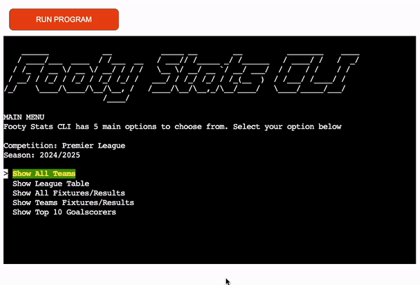
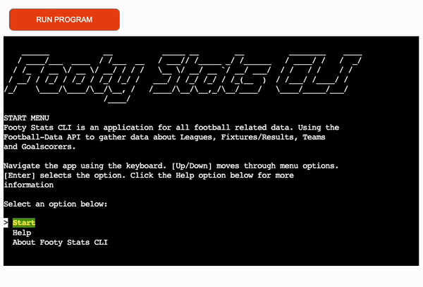

# Footy Stats CLI

Live site: [Footy Stats CLI](https://footy-stats-cli-7fb9beca2387.herokuapp.com/)

## About
Footy Stats CLI is a command line interface tool built using Python. It utilises 
the [football-data.org](https://www.football-data.org/) API. The aim of this application 
is to give value to the underlying API. Allowing end users to easily access, display 
and find the relevant information they need about a league, club or particular season. 

## Design
I wanted the initial design for the application to intuitive to the user and easy
to navigate. The approach for the design was always "User First". To keep in mind
the problem that we were solving, easy access to football data. Menu's are navigated
using the keyboard. I didnt want any user input to navigate menus or to display the 
data. It needed to be easy to use. The application has a forward feeling to it. 
Always relying on keyboard entries to move around and navigate back and forth. 
When a user is viewing data they can use the keyboard to go back to the main menu.
With as little as two clicks on the main menu a user can select the data they 
want, see the data and go back to the main menu. The cycling menu feature saves 
time for a user they can quickly get from the last menu option to the first menu 
option with one click. 

- ### Inspiration
The idea behind how Footy Stats CLI should function and feel borrowed inspiration 
from the oldschool Teletext. Simply put, Teletext was the standard for displaying 
text and graphics on television sets. Its a nostalgic, childhood memory of checking
football scores on a saturday afternoon before the internet was made publicly 
available in Ireland. [More about Teletext](https://en.wikipedia.org/wiki/Teletext)

- ### Imagery 
The colors used in Footy Stats CLI are bright and visiually striking. The 
bright colors implemented in Footy Stats CLI were to mimic those found in Teletext,
seen below: 

- ### Wireframes
To get a better understanding of how the program would flow and fit together for 
the end user I created a wireframe using [Lucid Charts](https://www.lucidchart.com/pages/?)

- ## Research
I took notes when researching this project. Different potential projects for usings an 
API. The core idea was to always use an api and manipulate and display data to the end
user. The question was, what sort of data that would be. The links below show
some project planning and initial concepts. 

  - [Research](documentation/documents/Footy_Stats_Research.pdf)
  - [Initial Concept](documentation/documents/Footy_Stats_Initial_Concept.pdf)

## Features

- ### Iterable Menu 
All menu's are created with the help of python library [simple-term-menu](https://pypi.org/project/simple-term-menu/). 
It offers a cyclical scrolling which allows the user to navigate more quickly.

- ### Help Area
There is a help area on the start screen that provides a user with information on how to navigate the application.
It contains tips and tricks on how to best use the app. 

- ## About Area
There is also an about area on the start screen. This screen provides information to the user about what type of data they
can expect to see in the app. 

### Future Features

## Technologies

### Languages

### Other Tools

## Deployment

## Testing

## Credits

- ### Resources
 

- ### Media

- ### Helpful Links

- ### Acknowledgments 

## Bugs
