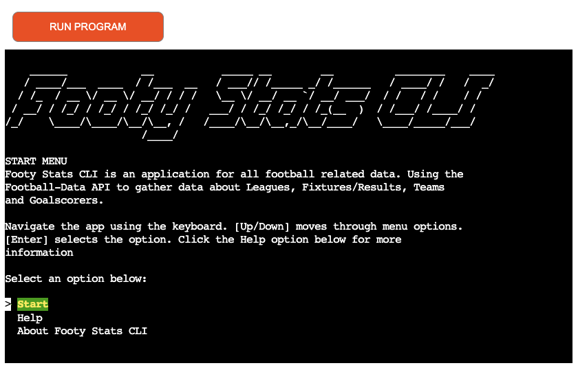

# Footy Stats CLI

Live site: [Footy Stats CLI](https://footy-stats-cli-7fb9beca2387.herokuapp.com/)

## About
Footy Stats CLI is a command line interface tool built using Python. It utilises 
the [football-data.org](https://www.football-data.org/) API. The aim of this application 
is to give value to the underlying API. Allowing end users to easily access, display 
and find the relevant information they need about a league, club or particular season. 

## Design
I wanted the initial design for the application to intuitive to the user and easy
to navigate. The approach for the design was always "User First". To keep in mind
the problem that we were solving, easy access to football data. Menu's are navigated
using the keyboard. I didnt want any user input to navigate menus or to display the 
data. It needed to be easy to use. The application has a forward feeling to it. 
Always relying on keyboard entries to move around and navigate back and forth. 
When a user is viewing data they can use the keyboard to go back to the main menu.
With as little as two clicks on the main menu a user can select the data they 
want, see the data and go back to the main menu. The cycling menu feature saves 
time for a user they can quickly get from the last menu option to the first menu 
option with one click. 

- ### Colour Scheme 

- ### Imagery

- ### Typography 

- ### Wireframes

## Target Audience

## Features

### Future Features

## Technologies

### Languages

### Other Tools

## Deployment

## Testing

## Credits

- ### Resources
 

- ### Media

- ### Helpful Links

- ### Acknowledgments 

## Bugs
