# Footy Stats CLI

Live site: [Footy Stats CLI](https://footy-stats-cli-7fb9beca2387.herokuapp.com/)


## About
Footy Stats CLI is a command line interface tool built using Python. It utilizes 
the [football-data.org](https://www.football-data.org/) API. The aim of this application 
is to give value to the underlying API. Allowing end users to easily access, display 
and find the relevant information they need about a league, club or particular season. 

## How To: Program Instructions
The program itself is simple to use. It utilizes the keyboard to navigate,
select and display data. Breakdown of controls:

- **[UP/DOWN ARROW KEYS]**: Navigate menu items. Menus are cyclical. Pressing down on the
last menu item will navigate to the first menu item. 
- **[ESC/Q]**: On menu screens, pressing either Q or ESC will navigate back to the previous 
menu screen. Allowing you to choose different criteria to display, e.g. different Leagues
or different Seasons
- **[ENTER]**: The Enter key is used to select a menu item. Once selected the program
will either show a menu screen or display data depending where you are in the program.
Enter can also be used when prompted, the app will ask the user to click Enter to progress.
- **[Q]**: Q, on its own, when viewing data from the main menu will navigate back to the main
manu. This option is used when the data displayed is paginated. 

## User Stories 

As a user, I want to be able to:

- Be guided through the program clearly.
- Feel comfortable with what I have to do next to use the program how I want.
- See the information I have asked for.
- Always have the option to navigate back if I need to.
- Seek help where appropriate.
- Know what it is I am viewing.
- Be prompted if I have done something wrong. 

## Design
I wanted the initial design for the application to intuitive to the user and easy
to navigate. The approach for the design was always "User First". To keep in mind
the problem that we were solving, easy access to football data. Menus are navigated
using the keyboard. I didn't want any user input to navigate menus or to display the 
data. It needed to be easy to use. The application has a forward feeling to it. 
Always relying on keyboard entries to move around and navigate back and forth. 
When a user is viewing data they can use the keyboard to go back to the main menu.
With as little as two clicks on the main menu a user can select the data they 
want, see the data and go back to the main menu. The cycling menu feature saves 
time for a user they can quickly get from the last menu option to the first menu 
option with one click. 

- ### Inspiration
The idea behind how Footy Stats CLI should function and feel borrowed inspiration 
from the old school Teletext. Simply put, Teletext was the standard for displaying 
text and graphics on television sets. It's a nostalgic, childhood memory of checking
football scores on a saturday afternoon before the internet was made publicly 
available in Ireland. [More about Teletext](https://en.wikipedia.org/wiki/Teletext)

- ### Imagery 
The colors used in Footy Stats CLI are bright and visually striking. The 
bright colors implemented in Footy Stats CLI mimic those found in Teletext,
seen below: 

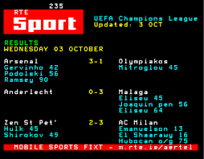
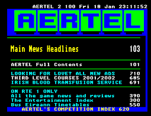

- ### Wireframes
To get a better understanding of how the program would flow and fit together for 
the end user I created a wireframe using [Lucid Charts](https://www.lucidchart.com/pages/?)

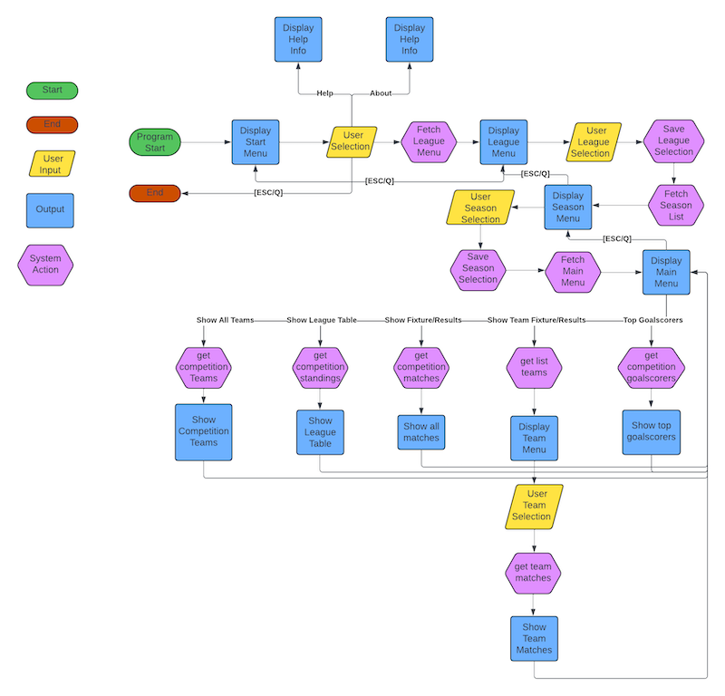

- ## Research
I took notes when researching this project. Different potential projects for usings an 
API. The core idea was to always use an api and manipulate and display data to the end
user. The question was, what sort of data that would be. The links below show
some project planning and initial concepts. 

  - [Research](documentation/documents/Footy_Stats_Research.pdf)
  - [Initial Concept](documentation/documents/Footy_Stats_Initial_Concept.pdf)

## Architecture
Before starting this project I spent some time researching python applications to get a sense 
of how best to approach the code. I didn't want a solution where everything was relying on 
run.py. I knew with what I wanted to achieve this could get messy and pose a lot of problems. 
Having used OOP from past experiences I wanted to incorporate those principals into
this project. I knew about this [GitHub repository](https://github.com/betcode-org/betfair) 
from Betfair. I was interested to see how they structured their code as it was similar in
the approach I wanted to take. Essentially, in the Betfair code they are making a call to 
an endpoint and receiving and displaying data. There is a lot of other functionality happening
with it that I wasn't concerned about. 

Using what I learnt from that codebase I applied a similar approach to my application. 
The class that handles everything to start a request is the APIClient(). APIClient is a 
child of BaseClient(). Initializing the APIClient() instance in main.py ```self.client = APIClient("PL")```
will init() the parent BaseClient() using super_init() passing the value of "PL" as the league.

In the init() of APIClient() it also creates an instance of the Competitions() and Team()
by passing a reference of self. The Competitions and Teams class, inheriting from
BaseEndPoint() calls the BaseEndPoints init(). BaseEndPoint then sets the instance variable 
self.client to be a reference to BaseClient() using the APIClient() instance. Each class
encapsulates its own behavior and data.

The approach uses both Inheritance and Composition to achieve this. Inheritance is 
described as a "is a" relationship where Composition is described as a "has a" relationship.

- APIClient() **is a** child of BaseClient()
- Competitions() and Teams() **is a** child of BaseEndPoint()
- Competitions() and Teams() **has a** reference to the APIClient()
- BaseEndPoint() **has a** reference to BaseClient() (Through child APIClient())

The benefits of taking this approach makes the application more robust and flexible.
Having classes that handle independent functionality makes it easier to maintain and update. 

- **APIClient()**: This class is used to create an instance using the input from the user. 
As the user progresses in the program we can set instance variables of the user's choices. It only
handles setting the instance variables needed from the user to make requests. 
- **BaseClient()**: This class handles everything that's needed to build a request. It defines
the URL, gets the secret key and creates the header. It has getter methods that can be used by other classes. 
- **BaseEndPoint()**: This class deals with making the requests to the API. It has a URL builder method
which uses variables from BaseClient() to build the correct url. It also has a method to make the request
and a method to process the response. 
- **Competitions()**: This class only handles functionality related to the competitions endpoint. It has methods
to get the data and clean the data as needed. It utilizes its parent BaseEndPoint() for requests. 
- **Teams()**: This class only handles functionality related to the team's endpoint. It has methods
for getting and cleaning the data as needed. 

Having clearly defined functionality in separate classes allows the program to be more flexible.
Using encapsulation where each class has its own behavior and data makes it easier to use and 
easier to maintain without having to update a lot of the codebase. It also follows best practices for using OOP.
For example, the football-data api has another endpoint called People. To introduce this into the current program 
would be as easy as creating a new person class similar to Competitions() and Teams(). It can utilize the BaseEndPoint 
to make requests.

That's the core architecture of the program. There are other concepts introduced to make it easier to maintain:

- **MainUtil()**: MainUtil is a mixin which handles the logic of the menus. Its used by main.py
- **EndpointUtil()**: EndpointUtil is also a mixin which handles functionality shared by Competitions()
and Teams()
- **AppText()**: AppText is a simple class that holds a number of class variables which define the text used 
throughout the menu screens. It's separated from MainUtil to make the code easier to maintain. 

## Features

- ### Iterable Menu 
All menus are created with the help of Python library [simple-term-menu](https://pypi.org/project/simple-term-menu/). 
It offers a cyclical scrolling which allows the user to navigate more quickly.

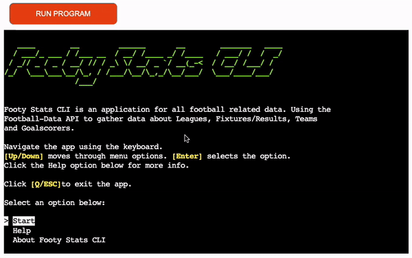

- ### Help & About Area
There is a Help area on the start screen that provides a user with information on how to navigate the application.
It contains tips and tricks on how to best use the app. There is also an About area on the start screen. This screen 
provides information to the user about what type of data they can expect to see in the app. 


- ## Dynamic Menus
Menus are created using the [simple-term-menu](https://pypi.org/project/simple-term-menu/) this allows users to
select an option with their keyboard. No need for extra steps such as entering a value and clicking enter. This
leads to an enhanced user experience. 


- ## Saving User Selection
The menus displayed to the user are strategically placed. The League menu appears prior to the Seasons menu.
This allows the program to dynamically build the APIClient before making a request for data. It also allows the 
program to display the league and season to the user on the main menu screen. 

The same can be said for the Team menu. Before making a request for Team data, we ask the user to select their 
team of choice. The APIClient is then updated with the team's ID so we can make a request for data.


- ## Back Navigation
A user always has the option to navigate back to the previous menu/screen. This helps the user either, navigate
back if they have selected the wrong option and choose a different selection. i.e A user can select the 2022/2023
season, view all the data and then navigate back to the Seasons menu and select a new season and view that data.
It allows the user to get everything they want, without leaving the program. The same can also be said for choosing
a different League option.


- ## Team Data
The program can display information about all teams that participated in that League during that season. It shows the 
Team, Year it was founded and the Stadium they play in. 


- ## League Table
The program can display information about the League Table for a particular season. It shows the Team, Matches Played,
Matches Won, Drawn Matches, Lost Matches, Total Points. 


- ## Fixtures and Results
The program can display information about all of the Fixtures and Results for a League in a particular season. It shows 
the Date Played, Home Team, Away Team and the Score. 


- ## Team Fixtures and Results
The program can go one step further and display individual teams matches for a particular League and Season. It shows
the Date Played, Home Team, Away Team and the Score. 

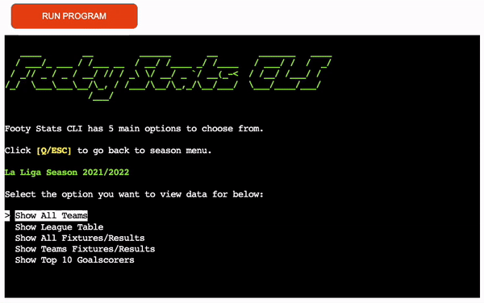

- ## Top 10 Goalscorers
The program can display the Top 10 Goalscorers for a particular League and Season. It shows the Players Name, Players Team, 
Count of Matches and the Count of Goals Scored. 


- ## Leagues and Seasons
The program displays 5 Leagues and 5 Seasons. The Leagues shown are hardcoded. The only reason these leagues are hardcoded
is due to the restriction of the API Access Token the program uses. Seasons are automatically generated from the API. The 
program only shows the last 5 seasons due to the Access Token restrictions. There is a check before requesting the seasons 
for a league, if the season count is >= 5 then show 5 seasons. Else show the number of seasons available. 

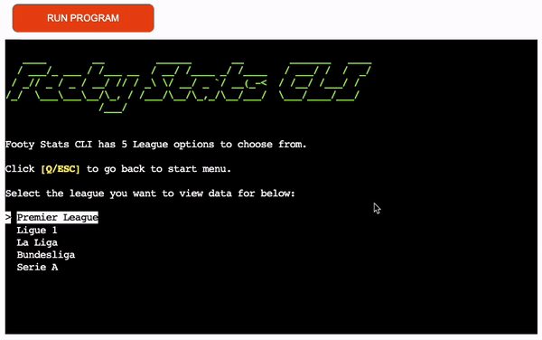

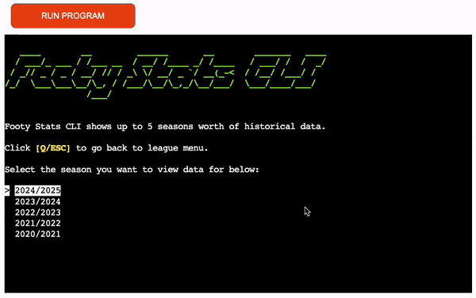

- ## Input Handling
The program will only accept the keyboard input it asks for. If the user enters something other than what is asked for then 
the program displays a warning message saying "Sorry, that's not a valid action. Please try again" in red.

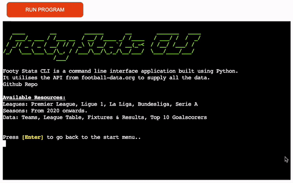


## Future Development
There are a number of features I wanted to introduce but did not have the time or were restricted in creating. 

- ### More Seasons
The football-data api has more seasons than what is displayed in the program. The reason we limit it to 5 is due to the 
subscription I have. It only has access to 5 seasons. Updating the subscription would allow the program to use every season
available for each league.

- ### More Leagues
Same again, the restrictions of the Leagues is due to the limits of the access token being used. Updating the subscription
to football-data would allow the program to get more data from more leagues. 

- ### Display More Data
Due to the limits of the terminal width used on Heroku, the data displayed had to be carefully selected. Not all the data
I wanted could fit into the terminal window. 

- ### Ability for users to enter their own football-data access token
A user who already has an access token for football-data should have the ability to input their access token. This would
allow for more flexibility. A user could have a different subscription to football-data than the program uses allowing them to see
more data.

- ### Try/Except
Currently the program handles response status codes using if/else. if the response status code is not 200 then display a message.
else show the data. This should be updated in the future to use try/except. 

## Libraries

- ### [os](https://docs.python.org/3/library/os.html)
Used for both clearing the display by determining what os is being used to print the right call and to get the secret key.
- ### [typing](https://docs.python.org/3/library/typing.html) 
Used to describe the correct function annotation for paginate method in MainUtil.
- ### [datetime](https://docs.python.org/3/library/datetime.html)
Used in both Competitions() and EndpointUtil() class to format date data returned from API.
- ### [blessed](https://pypi.org/project/blessed/) 
Used in both AppText() and MenuUtil(). In AppText blessed it used to add colour to strings. In MenuUtil blessed is used 
to accept the correct keyboard input by using the inkey() method.
- ### [tabulate](https://pypi.org/project/tabulate/) 
Used in the MainUtil() class. It formats the list of data returned from the API into a table. 
- ### [simple term menu](https://pypi.org/project/simple-term-menu/) 
Used in the MainUtil() class. It creates a menu with the necessary information. 
- ### [dotenv](https://pypi.org/project/python-dotenv/)
Used in the BaseClient() class. Using the load_dotenv() to read the key value of the secret key.
- ### [requests](https://pypi.org/project/requests/)
Used in the BaseEndPoint() class to make requests to the API. 

## Testing

### Manual Testing

The following manual testing is done in chronological order as a user progress through the app
and the actions they take and what result they should see.

| Test      | Outcome | Result  |
| ----------- | ----------- | ----------- |
| Load Application on Heroku     | Start screen displayed       | Pass    |
| Up/Down Arrow Key   | Moves through menu        | Pass            |
| Any other keyboard input   | Doesn't illicit any action        | Pass    |
| Select Help option   | Help screen is shown        | Pass            |
| Any keyboard input other than Enter   | Warning message is shown        | Pass   |
| Enter key   | Navigate back to start menu        | Pass            |
| Select About option   | About screen is displayed        | Pass    |
| Any keyboard input other than Enter   | Warning message is shown        | Pass  |
| Enter key   | Navigate back to start menu        | Pass            |
| Select Start option   | League menu is displayed        | Pass     |
| Up/Down Arrow Key   | Moves through menu        | Pass      |
| Any other keyboard input   | Doesn't illicit any action        | Pass    |
| Select any League option   | Show Seasons list        | Pass     |
| Up/Down Arrow Key   | Moves through menu        | Pass    |
| Any other keyboard input   | Doesn't illicit any action        | Pass  |
| Select any Season option   | Show Main menu        | Pass   |
| Up/Down Arrow Key   | Moves through menu        | Pass            |
| Any other keyboard input   | Doesn't illicit any action        | Pass   |
| Pressing Q or ESC when viewing Menu Screen   | Navigate back to the previous menu       | Pass    |
| Select Show All Teams option   | Display the Teams data        | Pass    |
| Select League Table option   | Display the League Table data        | Pass    |
| Select Show All Fixtures/ Results option   | Display the Fixtures/Results data        | Pass   |
| Select Show Teams Fixtures/ Results option   | Display the Teams Fixtures/results data        | Pass   |
| Select Show Top 10 Goalscorers option   | Display the Top 10 Goalscorers data        | Pass   |
| If no data is present in the API for a current season| Display a message sorry no data found        | Pass  |
| When viewing data from the main menu on a paginated screen|-----------|
| Any keyboard input other than Enter or Q  | Warning message is shown        | Pass  |
| Enter keyboard input  | Display next page        | Pass   |
| Q keyboard input  | Back to main menu        | Pass    |
| When viewing data from the main menu on a non paginated screen| ----------- |
| Any keyboard input other than Enter  | Warning message is shown        | Pass  |
| Enter keyboard input  | Display next page        | Pass    |

### PEP8
All files pass the [CI Python Linter](https://pep8ci.herokuapp.com/#) with no errors.

I kept getting the following error for the ASCII logo [Invalid escape sequence 'x' (W605)](https://www.flake8rules.com/rules/W605.html).
The way its currently formatted is to comply with PEP8.

See the results of each file here.


## Deployment

- ## Deployment To Heroku
    - Login into [Heroku](https://id.heroku.com/login) and sign in or sign up if you dont have an account. 
    - Click 'New' on the top right of the screen.
    - Select 'Create New App'
    - Enter a unique name for the application and choose the region most appropriate to your location.
    - Click 'Create App'
    - The app should now be created and you are viewing the Deploy screen.
    - Click on the 'Settings' tab.
    - Find the section called 'Config Vars'. Click 'Reveal Config Vars'.
    - In the KEY field, enter 'FOOTBALL_DATA_API_KEY'
    - In the VALUE field, enter your football-data API Key
    - Click 'Add'
    - You will need to add another 'Config Var'
    - In the KEY field, enter 'PORT'
    - In the VALUE field, enter '8000'
    - Click 'Add'
    - On the same page, navigate to the Buildpacks section.
    - You will need to add two buildpacks.
    - Click 'Add buildpack' and select the 'python' option. Click 'Add buildpack'
    - Add another buildpack
    - This time select 'nodejs' and click 'Add buildpack'
    - Make sure the order of the buildpacks is heroku/python first then heroku/nodejs.
    - Click the 'Deploy' tab at the top of the screen.
    - Select 'Github' as the Deployment Method
    - Search for the correct depository and click 'Connect'
    - Choose either 'Enable Automatic Deploys' in the Automatic Deploys section or select 'Deploy Branch' in the Manual Deploy section
    - Wait for the App to build and click 'View'

- ## Deployment on a local machine
    - Open the [Footy Stats CLI github](https://github.com/MarkClinton/footy-stats-cli) repository
    - Select Code, choose HTTPS tab and clone the url. For more information see this [link](https://docs.github.com/en/repositories/creating-and-managing-repositories/cloning-a-repository)
    - Clone the repo to your local machine in a terminal window using ```git clone https://github.com/MarkClinton/footy-stats-cli.git```
    - The next step is optional if you don't want to add the libraries to your local machine
        - ```cd``` to the root of the cloned project
        - Create a virtual env folder inside the root directory
        - Use the command ```python3 -m venv env``` to create an env folder
        - Add the env folder to your .gitignore
        - Run the command ```source env/bin/activate``` to activate the virtual environment
    - Run the command ```"pip3 install -r requirements.txt"``` to install the requirements
    - Run ```python3 run.py``` to run the program

## Credits

- ### Resources
    - [football-data.org](https://www.football-data.org/)
    - [EZGif](https://ezgif.com/)
    - [StackOverflow](https://stackoverflow.com/)
    - [Love Sandwiches](https://github.com/MarkClinton/love-sandwiches)
    - [CodeInstitute Python Essentials Module](https://codeinstitute.net/ie/)
    - [Corey Schafer Youtube Channel](https://youtu.be/ZDa-Z5JzLYM)
    - [ASCII Text Generator](https://patorjk.com/software/taag/#p=display&f=Graffiti&t=Type%20Something%20)

- ### Helpful Links
    - [Working with JSON data in Python](https://realpython.com/python-json/)
    - [Weather API tutorial in Python](https://www.youtube.com/watch?v=9P5MY_2i7K8)
    - [Working with APIs in Python](https://www.youtube.com/watch?v=-oPuGc05Lxs)
    - [Consuming Web APIs with Python](https://itnext.io/consuming-web-apis-with-python-fa9b751d2c75)
    - [How to use Web APIs in python3](https://www.digitalocean.com/community/tutorials/how-to-use-web-apis-in-python-3)
    - [How to Hide API Keys in Python: An Environment Variables Example](https://www.youtube.com/watch?v=FrQ46MPSpUs&t=1s)
    - [PP3 Batlleships](https://github.com/dnlbowers/battleships)
    - [Python: Inheritance versus Composition ](https://stackoverflow.com/questions/20847727/python-inheritance-versus-composition)
    - [Unpack list of dicts](https://teamtreehouse.com/community/unpacking-challenge-how-do-you-unpack-within-a-list-of-dictionaries)
    - [Sort by dict values](https://www.youtube.com/watch?v=OY9AULPtLIU)
    - [Request library with REST API](https://blog.networktocode.com/post/using-python-requests-with-rest-apis/)
    - [Clear console in python](https://www.delftstack.com/howto/python/python-clear-console/)
    - [Yield in python for pagination](https://www.geeksforgeeks.org/use-yield-keyword-instead-return-keyword-python/)
    - [Betfair API Wrapper](https://github.com/betcode-org/betfair) 

- ### Acknowledgments 
    - Thanks to my mentor [Juliia](https://github.com/IuliiaKonovalova) for all the help along the way with this project. 
    - A special shoutout to my girlfriend Aoife who helped keep me sane during this project. 
    - Thanks to [CodeInstitute](https://codeinstitute.net/ie/) who created the web terminal to display this Python project.

## Bugs

 - ### Persistent Print on Heroku
 There was an issue where if the content I was printing to the terminal was greater than 24 rows in length, the cutoff of the
 content would persistently be displayed throughout the program. Although it would be hidden, the user could still scroll up
 and see this. Since the program prints a lot of data to the screen and refreshes what the user should see it was an issue. 

 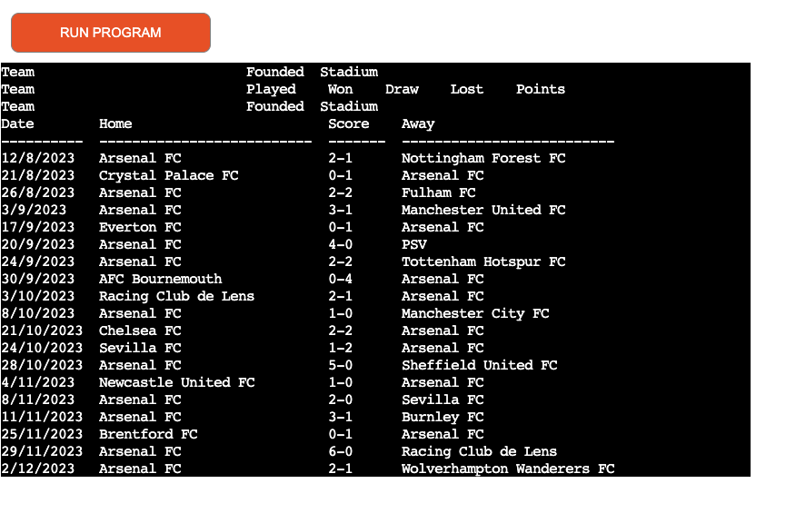

**Cause**: The cause of this was due to the 'clear' command only clearing what was visible on the screen. If the content was 
30 rows in height, it would leave 6 rows of content in the scrollback buffer. 

 **Solution**: The fix for this was to introduce the following snippet of code in the clearDisplay() method.
 ``` 
 print("\033[3J\033[H\033[2J", end='')
        os.sys.stdout.flush()
```
It prints a combination of ANSI escape codes to the terminal which clears the scrollback buffer, moves cursor to the top left corner
and clears the entire terminal. 

- ### Using getch.pause() to accept user input
The pause() function from the python library [getch](https://pypi.org/project/getch/) was originally used to accept keyboard input
from the user to progress the app i.e. "Click Any Key to go back to Start Menu". An example of this behavior can be found
when viewing paginated data and using an arrow key to move to the next page. It skips 3 pages. 

 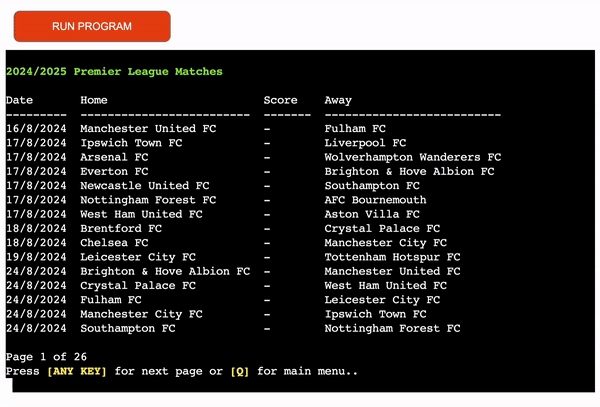

**Cause**: The pause() function doesn't handle arrow keys as input very well. It doesn't clean or decode the arrow key input. This meant it was 
filling the input buffer with 3 inputs every time it was used with the pause() method.

 **Solution**: Blessed was already being used to add color to text. Blessed also had functionality to handle keyboard input. I created
 2 methods called ```user_enter_action``` and ```user_enter_or_action```. Utilizing Blessed's keyboard input functionality, ```user_enter_action```
 only accepts enter as an input and throws a warning on screen when enter is not selected. ```user_enter_or_action``` method was created
 to handle input on paginated screens. It needed to have 2 options, either Enter for the next page or Q to go back to the main menu. It also throws 
 a warning on screen it the keyboard input isnt one of those values

 - ### Menu content half prints to screen when menu is used
 There was an issue when using blessed to introduce color to the program. 

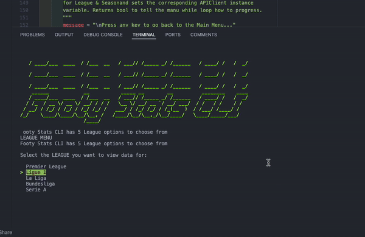

 **Cause**: The cause of this issue was using coloured text in the title of TerminalMenu(). For whatever reason it didnt like this. 

 **Solution**: The fix for this was to move the majority of the screen content out of the title of a TerminalMenu() and not use
 coloured text in the title. This meant some refactoring to achieve the same functionality. 


